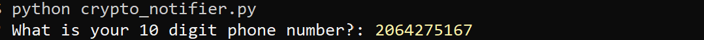
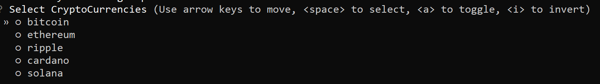

# Crypto_notifier

[Planning doc](https://docs.google.com/document/d/1rUZfldYmy9Eqa9YMD0Sh2NcjxjiFe94NhCzngBFl1-c/edit)

The goal of this application is to allow deliver a comparison for user-chosen cryptocurrencies through a text message using the Twilio software package. The comparison is taking the historical return values of the currencies chosen and creating a threshold value which is used to compare daily return values of recent times. 


---

## Required Installs

### Language: Python 3.9.12

### Libraries used:

[Pandas](https://pandas.pydata.org/pandas-docs/stable/index.html) - For the creation and manipulation of Data Frames

[Jupyter Labs](https://jupyter.org/) - An ipython kernel for interactive computing in python

[OS](https://docs.python.org/3/library/os.html) - Miscellaneous operating system interface

[Dotenv](https://github.com/motdotla/dotenv) - Module to load environment variables 

[Questionary](https://pypi.org/project/questionary/) - Python module for easy CLI interaction

[Coin Gecko API](https://www.coingecko.com/en/api/documentation) - A free comprehensive cryptocurrency API

[Twilio](https://www.twilio.com/docs/usage/api) - API for sending SMS to a phone number after setting up an account

---

## Installation Guide

This application has quite a few working parts and it is necessary to ensure that all the correct packages have been installed correctly.

Firstly, we recommend using setting up an Anaconda environment to run this application. Additionally, all commands are going to be assuming GitBash is being used as the terminal and conda has been intialized. You can download Anaconda and Git Bash here: [anaconda_link](https://www.anaconda.com/), [git_bash](https://git-scm.com/downloads)

To create the right conda environment through Git Bash enter

```python
    conda create -n myenv python=3.9
    conda activate myenv
```

First check that all of the anaconda associated packages have been installed by running:

```python
    conda list jupyter
    conda list pandas
```

Next the packages not included need to be installed and this can be accomplished by entering the following in the Git Bash terminal.

```python
    pip install questionary
    pip install python-dotenv
    pip install -U pycoingecko
    pip install twilio
```

To check that all of the dependencies have been installed by entering the following into the Git Bash Terminal:

```python
    conda list questionary
    conda list dotenv
    conda list pycoingecko
    conda list twilio
```

With all of these packages the conda environment should be set up to run the Crypto Notifier application

---

## Usage

Prior to running the application it is necessary to create a Twilio Account. Sign up at [https://www.twilio.com/](https://www.twilio.com/)

There are 3 important pieces of information that need to be retrieved: the Twilio phone number associated with your account, the Twilio account ID and the Twilio authentication token.

These peices of information need to be stored in a **.env** file that is saved in the same repo as this application. The information needs to look like the following:
> "TWILIO_ACCOUNT_ID" = 'YOUR ACCOUNT ID HERE'

> "TWILIO_AUTH_TOKEN" = 'YOUR AUTHENTICATION TOKEN HERE'

> "TWILIO_PHONE_NUMBER" = 'YOUR TWILIO PHONE NUMBER HERE'

Once the **.env** file has been created with an active Twilio phone number and credentials everything should be set up to run the application.

To run the application first activate the conda environment associated with the necessary packages and libraries. Navigate to this application's folder repo and run the application with the following commands:

```python
    conda activate myenv
    cd Crypto_notifer
    python crypto_notifer.py
```

This will prompt the user to enter their 10 digit phone number:



After entering a phone number the user will be given a choice of 5 crypto currencies to choose from 



To select multiple cryptocurrencies for analysis the user must use the SPACE bar to highlight multiple currencies then press ENTER to advance through the program.

The final display will show:


---

## Highlights:

---

## Contributors

Created by Ben Spiegel, Silvano Ross and Tracie Stipp while in the UW FinTech Bootcamp
> Contact Info: /n
> email: brspiegel@gmail.com |
> [GitHub]() |
> [LinkedIn]()
>
> email: stipptracie@gmail.com |
> [GitHub](https://github.com/stipptracie) |
> [LinkedIn](https://www.linkedin.com/in/tracie-stipp-0719691b/)
>
> email: silvanoross3@gmail.com |
> [GitHub](https://github.com/silvanoross) |
> [LinkedIn](https://www.linkedin.com/in/silvano-ross-b6a15a93/)

---

